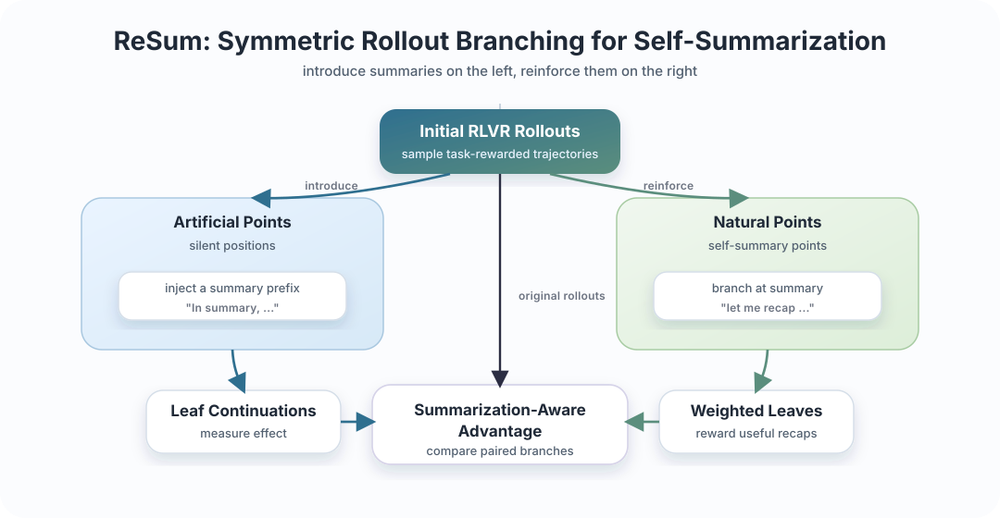

<h1 align="center">ReSum: Synergizing LLM Reasoning and Summarization with Reinforcement Learning</h1>

<p align="center">
  
  
  
  
</p>

<p align="center">
  <a href="#method">Method</a> |
  <a href="#results">Results</a> |
  <a href="#installation">Installation</a> |
  <a href="#training">Training</a> |
  <a href="#evaluation">Evaluation</a> |
  <a href="#citation">Citation</a>
</p>

<p align="center">
  ReSum teaches LLMs to compress and reorganize their own long reasoning
  trajectories through self-summarization, improving accuracy while reducing
  unnecessary rollout length.
</p>

---

<a id="overview"></a>

## 🧭 Overview

ReSum is a reinforcement learning framework for long-horizon LLM reasoning. It
incentivizes models to use self-summarization as an internal control mechanism:
the model learns to consolidate intermediate reasoning, recover from bad
prefixes, and avoid unnecessarily long rollouts.

This repository contains the Open-R1/TRL-based implementation used for ReSum
experiments on mathematical reasoning and multimodal GEOQA-style reasoning.

<a id="highlights"></a>

## ✨ Highlights

| Component | What it does |
| --- | --- |
| **Summarization-aware rollouts** | Augments GRPO with tree rollouts from injected and naturally occurring summarization points. |
| **Natural-summary incentives** | Rewards rollouts that spontaneously summarize through leaf weighting and an advantage bonus. |
| **Model-agnostic recipes** | Provides configs for Qwen2.5-Math, Qwen2.5, DeepSeek-Math, and Qwen2.5-VL backbones. |
| **Measured gains** | Reports 2.31%-4.75% accuracy improvements and an 18.6% reduction in average rollout length. |

<a id="method"></a>

## 🧠 Method

<p align="center">
  
</p>

Standard RLVR methods such as GRPO optimize final-answer rewards, but they can
encourage long and repetitive chain-of-thought trajectories. ReSum instead
turns self-summarization into a trainable behavior.

For each prompt, ReSum first samples ordinary rollouts. It then builds a rollout
tree:

1. **Artificial summarization points.** For non-summary positions, the trainer
   truncates a rollout, injects a natural-language summary prefix such as
   `In summary,`, and samples several leaf continuations.
2. **Natural summarization points.** If the rollout already contains phrases
   such as `to summarize`, `let me recap`, or `let me check`, the trainer
   branches from that position and weights those leaves more strongly.
3. **Summarization-aware advantages.** Original rollouts and leaf continuations
   are scored with the task reward and merged into the same prompt group for
   advantage computation. Natural summaries can additionally receive a direct
   bonus.

In code, the main implementation lives in:

- `src/open_r1/grpo_sum.py`: ReSum training entry point.
- `src/open_r1/sum/sum_trainer.py`: GRPO trainer extension with rollout
  branching, natural-summary detection, leaf generation, and advantage logic.
- `src/open_r1/sum/`: summarization utilities, rewards, and branch helpers.
- `recipes/*/grpo/config_grpo_sum*.yaml`: ReSum training configurations.
- `scripts_resum/`: launch scripts for GRPO, DGPO, ReSum, and ablations.

<a id="results"></a>

## 📊 Results

The paper evaluates ReSum on AIME24, AIME25, AMC23, MATH500, Minerva, and
Olympiad. Selected reported results are below.

### Qwen2.5-Math-7B

| Method | AIME24 | AIME25 | AMC23 | MATH500 | Minerva | Olympiad | Avg. |
| --- | ---: | ---: | ---: | ---: | ---: | ---: | ---: |
| GRPO | 20.94 | 8.44 | 58.98 | 72.20 | 27.76 | 37.33 | 37.61 |
| DGPO | 23.85 | 10.21 | 61.02 | 74.25 | 31.07 | 38.33 | 39.79 |
| ReSum | 25.42 | 13.33 | 62.50 | 76.45 | 32.44 | 39.67 | 41.64 |

### Other Backbones

| Backbone | GRPO Avg. | DGPO Avg. | ReSum Avg. |
| --- | ---: | ---: | ---: |
| Qwen2.5-Math-1.5B | 29.39 | 30.71 | 33.07 |
| Qwen2.5-3B | 25.47 | 27.19 | 28.81 |
| DeepSeek-Math-7B | 14.91 | 16.53 | 17.32 |

The paper also reports that ReSum combines well with GPG, DAPO, and GSPO, and
improves GEOQA-8K multimodal reasoning with Qwen2.5-3B-VL-Instruct.

<a id="installation"></a>

## ⚙️ Installation

Create a Python environment and install the local Open-R1 package plus the
vendored TRL version:

```bash
conda create -n resum python=3.10
conda activate resum

pip install torch==2.6.0 torchvision==0.21.0 torchaudio==2.6.0
pip install vllm==0.8.5.post1
pip install flash-attn==2.8.2 --no-build-isolation

pip install -e ".[dev]"
cd trl-0.20.0
pip install -e .
cd ..
```

Some launch scripts expect Hugging Face and Weights & Biases credentials to be
provided through the environment:

```bash
export HF_TOKEN=...
export WANDB_API_KEY=...
```

<a id="training"></a>

## 🚀 Training

Use the ReSum recipes and launch scripts under `scripts_resum/`. For example:

```bash
bash scripts_resum/Qwen2.5-Math-1.5B_MATH/run_sum.sh
```

or launch directly with Accelerate:

```bash
CUDA_VISIBLE_DEVICES=0,1,2,3,4,5,6,7 \
accelerate launch \
  --config_file recipes/accelerate_configs/zero3.yaml \
  --num_processes 8 \
  src/open_r1/grpo_sum.py \
  --config recipes/Qwen2.5-Math-1.5B/grpo/config_grpo_sum.yaml
```

Key ReSum knobs in the YAML configs:

- `sum_tree_inject`: enable artificial summary-prefix branching.
- `sum_tree_n_leaves`: number of leaf continuations per branch point.
- `sum_tree_trunc_ratios`: truncation ratios for artificial branch points.
- `sum_tree_max_new_tokens`: maximum continuation length for leaves.
- `natural_sum_inject`: enable natural summarization detection and branching.
- `natural_sum_leaf_weight`: weight multiplier for natural-summary leaves.
- `natural_sum_bonus`: direct advantage bonus for naturally summarizing rollouts.

<a id="evaluation"></a>

## 🧪 Evaluation

Mathematical reasoning evaluation:

```bash
CUDA_VISIBLE_DEVICES=0 bash eval/evaluate_math.sh <model_path>
```

Multimodal GEOQA evaluation:

```bash
CUDA_VISIBLE_DEVICES=0 bash eval/evaluate_geoqa.sh <model_path>
```

The evaluation script also supports an enriched summarization prompt baseline:

```bash
CUDA_VISIBLE_DEVICES=0 bash eval/evaluate_math.sh <model_path> --enrich-prompt true
```

<a id="citation"></a>

## 📚 Citation

```bibtex
coming soon
```
